<p align="center">
  
</p>

<h1 align="center">Claude Code Motion Collection</h1>

<p align="center">
  Thirty community-created animated SVG stories built around the supplied Claude Code mark.
</p>

## Motion contract

Every scene keeps the supplied mascot path unchanged:

```text
M20.998 10.949H24v3.102h-3v3.028h-1.487V20H18v-2.921h-1.487V20H15v-2.921H9V20H7.488v-2.921H6V20H4.487v-2.921H3V14.05H0V10.95h3V5h17.998v5.949zM6 10.949h1.488V8.102H6v2.847zm10.51 0H18V8.102h-1.49v2.847z
```

The collection uses separate nested transform owners for horizontal travel, vertical travel, rotation, scale, props, and contact shadows. Ballistic arcs and the pendulum period are generated from `svg-mascot-animator/scripts/physics.py`. Every scene uses a `360 × 240` frame, keeps visible motion inside the viewBox across the complete loop, moves the mascot itself by at least two rendered pixels, and includes a `prefers-reduced-motion` fallback.

## Gallery

| Story | Preview | Raw Markdown |
| :--- | :---: | :--- |
| **Terminal Sprint** |  | `` |
| **Bug Hunt** | 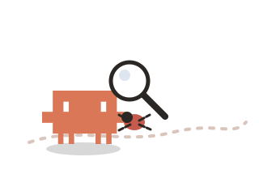 | `` |
| **Git Merge** |  | `` |
| **Context Juggle** | 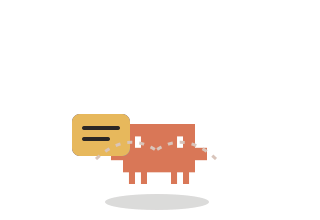 | `` |
| **Release Launch** |  | `` |
| **Review Pass** |  | `` |
| **Pair Session** |  | `` |
| **Refactor Pull** |  | `` |
| **Test Lab** |  | `` |
| **Coffee Compile** |  | `` |
| **Focus Lock** |  | `` |
| **Memory Search** |  | `` |
| **Package Drop** |  | `` |
| **Incident Response** |  | `` |
| **Branch Swing** | 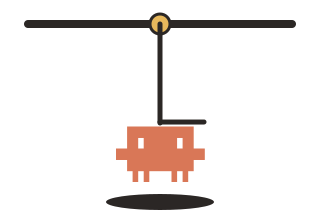 | `` |
| **Token Rain** |  | `` |
| **Prompt Fishing** |  | `` |
| **Agent Conductor** |  | `` |
| **Build Sleep** |  | `` |
| **Victory Dance** |  | `` |
| **Trampoline Bounce** |  | `` |
| **Skate Grind** |  | `` |
| **Jack-In-The-Box** |  | `` |
| **Weightlifter** |  | `` |
| **DJ Scratch** |  | `` |
| **Ninja Dash** |  | `` |
| **Balloon Float** |  | `` |
| **Magician Hat** |  | `` |
| **Pinball Bumper** |  | `` |
| **Breakdance Windmill** |  | `` |

## Verification

```bash
bun run generate:claude-code
bun test tests/claude-code-collection.test.ts
bun run validate:claude-code
bun run motion:bounds
```

## Trademark note

Claude Code and its mark belong to their respective owner. The surrounding scenes and motion treatments are community-created and are not presented as endorsed artwork.
