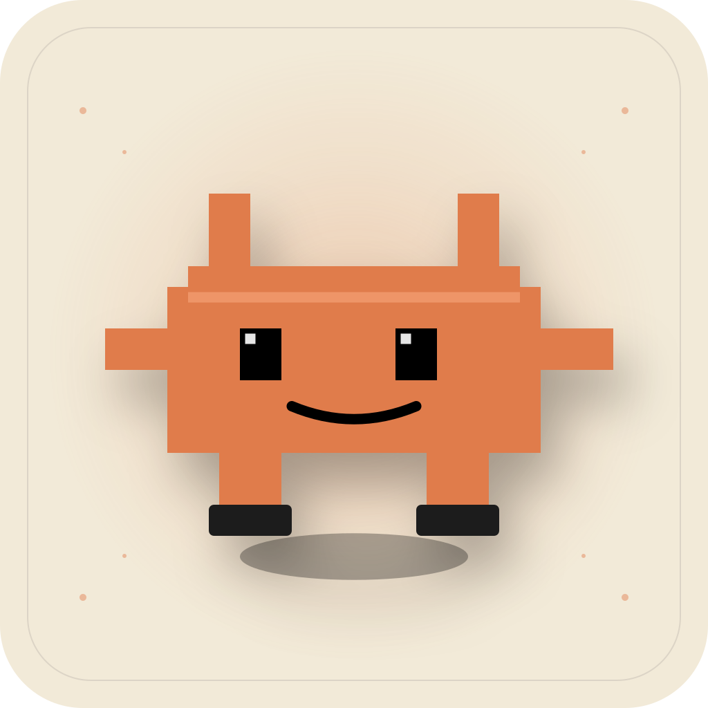
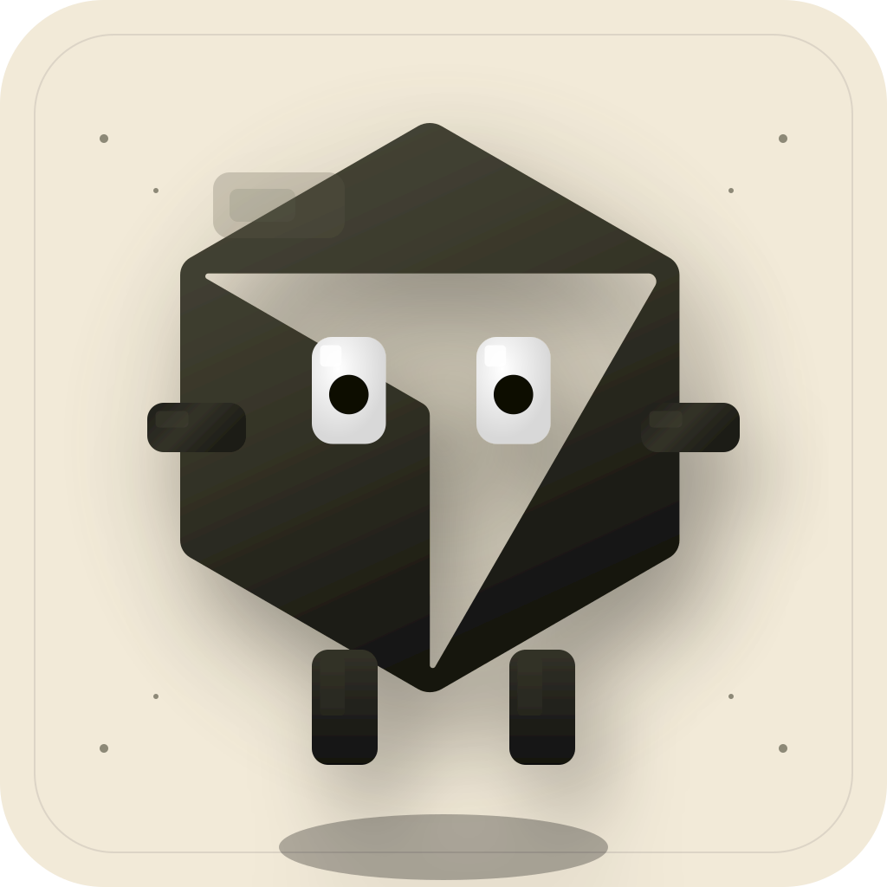
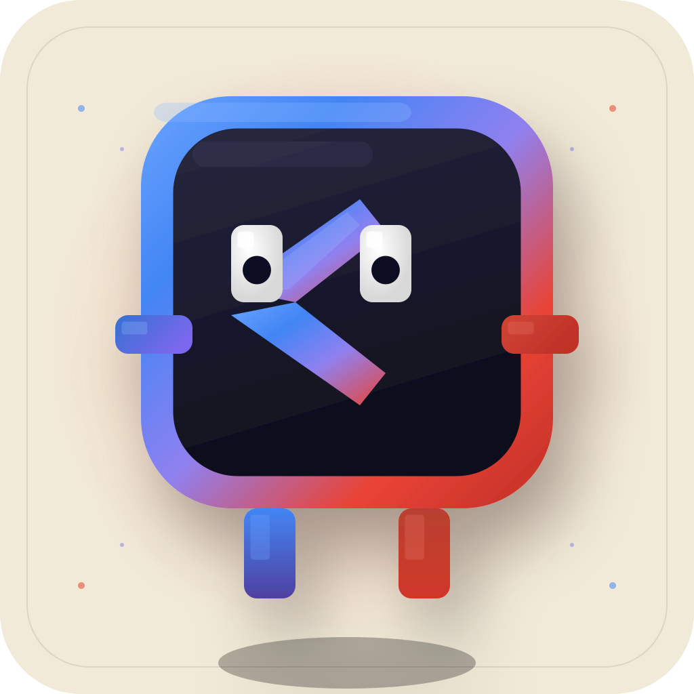

<p align="center">
  
</p>

<h1 align="center">✨ Agentic Engineering & Vibe Coding SVGs ✨</h1>

<p align="center">
  
  
  
  
</p>

<p align="center">
  
</p>

<p align="center">
  
  
  
  
  
</p>

---

## 🤖 Official 3D AI Mascots Action Gallery

| AI Mascot | Action / Scenario | Preview | Markdown Copy Snippet |
| :--- | :--- | :---: | :--- |
| **Claude Code** | **Claude Sleeping on 200K Tokens** |  | `` |
| **Claude Code** | **Sherlock Detective Debugging** |  | `` |
| **Claude Code** | **Official 3D Katana Mascot** |  | `` |
| **Claude Code** | **Jumping with Happiness** |  | `` |
| **OpenAI / Codex** | **100% Confident Hallucination** |  | `` |
| **OpenAI / Codex** | **Official 3D Sword Agent** |  | `` |
| **Cursor AI** | **Gamer Headphones Auto-Tab Rampage** |  | `` |
| **Cursor AI** | **Official 3D Dark Olive Mascot** |  | `` |
| **Google Gemini** | **Zero-G Levitating Orbit** |  | `` |
| **Google Gemini** | **Official 3D Sparkle Mascot** |  | `` |
| **DeepSeek** | **Scuba Goggles Deep Dive** |  | `` |
| **GitHub Copilot** | **Ninja Headband Stealth** |  | `` |

---

## 💬 WhatsApp Community Stickers (SVG)

<p align="center">
  
  
  
  
</p>

---

## 🏷️ Animated Vibe Coding Badges

| Badge Name | Preview | Markdown Snippet |
| :--- | :---: | :--- |
| **0% Code Written By Human** |  | `` |
| **Prompt & Pray Strategy** |  | `` |
| **Context Window 99.9%** |  | `` |
| **Vibe Coding Certified** |  | `` |
| **AI Reviewer Approved** |  | `` |
| **Refactored Legacy Code** |  | `` |
| **YOLO Production Deploy** |  | `` |

---

## 💻 Local Development & Showcase App

Run the interactive web showcase application locally using **Bun**:

```bash
# Start local development server with Bun
bun x serve .
```

Open `http://localhost:3000` in your browser to explore the live gallery, copy markdown snippets, and use the **Interactive Custom Badge Generator**!

---

## 📄 License

This repository is licensed under the [MIT License](LICENSE). Feel free to use, modify, and share these SVGs across all your open-source projects and GitHub profiles!
