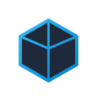

<p align="center">
  
</p>

<h1 align="center">Vibe SVGs</h1>

<p align="center">
  A high-quality, community-created collection of animated 2.5D SVG mascots, scenes, badges, and banners for developer documentation and project pages.
</p>

<p align="center">
  
  
  
  
  
</p>


<!-- project-story:start -->
<details open>
  <summary><strong>Problem to project: Why I built Vibe SVGs</strong></summary>
  <br />
  <p align="center"></p>
  <table>
    <tr>
      <td width="104" align="center" valign="middle"></td>
      <td valign="middle"><strong>Vibe SVGs</strong><br />An accessible collection of animated 2.5D SVG assets for developer documentation and project pages.</td>
    </tr>
  </table>
  <table>
    <tr>
      <td width="50%" valign="top"><strong>Recurring problem</strong><br />Developer READMEs often rely on generic badges or inconsistent AI-made illustrations that break accessibility, motion, or inline SVG safety.</td>
      <td width="50%" valign="top"><strong>Practical goal</strong><br />Provide expressive reusable SVG mascots, badges, scenes, and banners with clear accessibility and technical contracts.</td>
    </tr>
    <tr>
      <td width="50%" valign="top"><strong>Built for</strong><br />Open-source maintainers, developer-tool builders, technical writers, and AI-assisted design workflows.</td>
      <td width="50%" valign="top"><strong>Search terms</strong><br />developer README SVG · animated coding mascots · accessible SVG assets · AI developer illustrations</td>
    </tr>
  </table>
  <p><strong>Daily build pulse</strong></p>
  <ul>
      <li>62 commits landed: ci: refresh minimal story card after workflow changes; docs: add dynamic project story card (#3).</li>
      <li>4 pull requests updated, led by #4: docs: add dynamic project story card.</li>
      <li>Daily summary covers 66 public activity items from the last 1 day.</li>
  </ul>
</details>
<!-- project-story:end -->

---

## 🎨 Asset Gallery & Categories

### 🧡 Claude Family

| Asset | Preview | Raw Markdown |
| :--- | :---: | :--- |
| **Claude Mascot** |  | `` |
| **Claude Jumping** |  | `` |
| **Claude Sleeping** |  | `` |
| **Claude Debugging** |  | `` |
| **Claude Speaking** |  | `` |
| **Claude HD Suite** |  | `` |

---

### 💜 Codex Family

| Asset | Preview | Raw Markdown |
| :--- | :---: | :--- |
| **Codex Mascot** |  | `` |
| **Codex Hallucinating** |  | `` |
| **Codex Jumping** |  | `` |
| **Codex Speaking** |  | `` |
| **Codex HD Suite** |  | `` |

---

### 🩵 Cursor Family

| Asset | Preview | Raw Markdown |
| :--- | :---: | :--- |
| **Cursor Mascot** |  | `` |
| **Cursor Auto-Tab / Rage** |  | `` |
| **Cursor HD Suite** |  | `` |

---

### ✨ Gemini Family

| Asset | Preview | Raw Markdown |
| :--- | :---: | :--- |
| **Gemini Mascot** |  | `` |
| **Gemini Levitating** |  | `` |
| **Gemini Jumping** |  | `` |
| **Gemini Speaking** |  | `` |
| **Gemini HD Suite** |  | `` |

---

### 🐋 DeepSeek Family

| Asset | Preview | Raw Markdown |
| :--- | :---: | :--- |
| **DeepSeek Mascot** |  | `` |
| **DeepSeek Diving** |  | `` |
| **DeepSeek HD Suite** |  | `` |

---

### 🤖 Copilot Family

| Asset | Preview | Raw Markdown |
| :--- | :---: | :--- |
| **Copilot Mascot** |  | `` |
| **Copilot Ninja** |  | `` |
| **Copilot HD Suite** |  | `` |

---

### 🏷️ Badges

| Badge | Preview | Raw Markdown |
| :--- | :---: | :--- |
| **Vibe Certified** |  | `` |
| **Zero Human Code** |  | `` |
| **Prompt & Pray** |  | `` |
| **Context Window Exceeded** |  | `` |
| **AI Reviewer Approved** |  | `` |
| **Refactored by Claude** |  | `` |
| **YOLO Deploy** |  | `` |

---

### 🖼️ Banners

| Banner | Preview | Raw Markdown |
| :--- | :---: | :--- |
| **Vibe Coding Arena** |  | `` |
| **AI Coding Tools Pills** |  | `` |
| **LLM & Reasoning Models** |  | `` |
| **Agentic Workflow** |  | `` |

---

### 🔖 Brand Marks & Logos

| Brand Mark | Preview | Raw Markdown |
| :--- | :---: | :--- |
| **Claude Brand Mark** |  | `` |
| **OpenAI Brand Mark** |  | `` |
| **Cursor Brand Mark** |  | `` |
| **Gemini Brand Mark** |  | `` |

---

## 🛠️ System Architecture & Features

Every asset in this library satisfies `contractVersion: 1`:

- **2.5D Illustration System**: Connected rounded body silhouettes, soft contact shadows, upper-left lighting keying, and multi-stop gradients.
- **Accessibility Gate**: Root `<svg role="img" aria-labelledby="...">` with `<title id="...">` and `<desc id="...">`.
- **DOM ID Safety**: Reusable IDs are scoped with `<filename-stem>-` prefixes to eliminate ID collisions when inlining multiple SVGs.
- **Motion Accessibility**: `@media (prefers-reduced-motion: reduce)` fallbacks present on all animated SVGs.
- **Visual Regression Engine**: Playwright automated snapshot pipeline rendering PNG snapshots at 96px, 160px, and 320px across light, dark, and transparent backdrops.
- **Repository SVGO Engine**: Custom `svgo.config.js` preserving viewBox, keyframes, title/desc, and accessibility attributes.

---

## 💻 Development & Verification

Requires **Bun 1.3.14** or later.

### Run Quality Gate & Tests

```bash
# Run full suite (SVG contracts, schema validation, typecheck, SVGO check)
bun run check

# Run Playwright visual regression snapshots
bun run snapshots

# Run SVGO optimization write mode (maintainers)
bun run svgo:write
```

### Inline SVG Namespacing

When embedding raw SVG markup directly into HTML, use `namespaceSvg()` to avoid ID collisions:

```ts
import { namespaceSvg } from "./scripts/svg-contracts";

const firstCard = namespaceSvg(svgSource, "card-1");
const secondCard = namespaceSvg(svgSource, "card-2");
```

---

## 📜 Trademark and Endorsement Notice

This repository contains original community artwork inspired by developer tools and AI products. Product names, logos, and trademarks belong to their respective owners.

Fan-made mascots and scenes in this repository are not endorsed by Anthropic, OpenAI, Cursor, Google, DeepSeek, GitHub, or other referenced companies. The MIT license applies to original repository code and artwork; it does not grant rights to third-party trademarks.

## 📄 License

Code and original artwork are released under the [MIT License](LICENSE).
