<p align="center">
  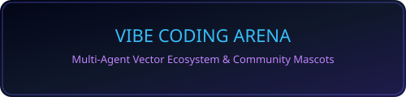
</p>

<h1 align="center">Vibe SVGs</h1>

<p align="center">
  A high-quality, community-created collection of animated 2.5D SVG mascots, scenes, badges, and banners for developer documentation and project pages.
</p>

<p align="center">
  
  
  
  
  
</p>


<!-- project-story:start -->
<details open>
  <summary><strong>Problem to project: Why I built Vibe SVGs</strong></summary>
  <br />
  <p align="center"></p>
  <table>
    <tr>
      <td width="104" align="center" valign="middle">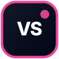</td>
      <td valign="middle"><strong>Vibe SVGs</strong><br />An accessible collection of animated 2.5D SVG assets for developer documentation and project pages.</td>
    </tr>
  </table>
  <table>
    <tr>
      <td width="50%" valign="top"><strong>Recurring problem</strong><br />Developer READMEs often rely on generic badges or inconsistent AI-made illustrations that break accessibility, motion, or inline SVG safety.</td>
      <td width="50%" valign="top"><strong>Practical goal</strong><br />Provide expressive reusable SVG mascots, badges, scenes, and banners with clear accessibility and technical contracts.</td>
    </tr>
    <tr>
      <td width="50%" valign="top"><strong>Built for</strong><br />Open-source maintainers, developer-tool builders, technical writers, and AI-assisted design workflows.</td>
      <td width="50%" valign="top"><strong>Search terms</strong><br />developer README SVG · animated coding mascots · accessible SVG assets · AI developer illustrations</td>
    </tr>
  </table>
  <p><strong>Daily build pulse</strong></p>
  <ul>
      <li>2 pull requests updated, led by #9: security: harden reusable SVG safety contract.</li>
      <li>Daily summary covers 2 public activity items from the last 1 day.</li>
      <li>Documentation and project status remain aligned with the repository’s current public state.</li>
  </ul>
</details>
<!-- project-story:end -->

---

## Mascot Animation Packs

The library includes 66 physics-driven pixel mascot animations across reactions, work, systems, security, growth, celebration, daily scenes, and hybrid sprite stories.

[Browse the complete pack catalog and usage guide](MASCOT-PACKS.md)

## 🎨 Asset Gallery & Categories

###  Claude Family

| Asset | Preview | Raw Markdown |
| :--- | :---: | :--- |
| **Claude Mascot** |  | `` |
| **Claude Jumping** |  | `` |
| **Claude Sleeping** |  | `` |
| **Claude Debugging** |  | `` |
| **Claude Speaking** |  | `` |


### 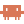 Claude Code Motion Collection

Twenty physics-driven animated stories built around the supplied Claude Code mascot path.

[View all 20 Claude Code animations](CLAUDE-CODE-COLLECTION.md)

<!-- claude-stories:start -->
### Claude Stories

| Story | Preview | Raw Markdown |
| :--- | :---: | :--- |
| **Claude Orchestrating** |  | `` |
| **Claude Context Overflow** |  | `` |
| **Claude Refactoring** |  | `` |
| **Claude Deep Thinking** |  | `` |
| **Claude Pair Programming** |  | `` |
| **Claude Shipping** |  | `` |
| **Claude Code Review** |  | `` |
| **Claude Coffee Break** |  | `` |
| **Claude Bug Hunting** |  | `` |
| **Claude Prompt Engineering** |  | `` |
<!-- claude-stories:end -->

---

###  Codex Family

| Asset | Preview | Raw Markdown |
| :--- | :---: | :--- |
| **Codex Mascot** |  | `` |
| **Codex Hallucinating** |  | `` |
| **Codex Jumping** |  | `` |
| **Codex Speaking** |  | `` |

---

###  Cursor Family

| Asset | Preview | Raw Markdown |
| :--- | :---: | :--- |
| **Cursor Mascot** |  | `` |
| **Cursor Auto-Tab / Rage** |  | `` |

---

###  Gemini Family

| Asset | Preview | Raw Markdown |
| :--- | :---: | :--- |
| **Gemini Mascot** |  | `` |
| **Gemini Levitating** |  | `` |
| **Gemini Jumping** |  | `` |
| **Gemini Speaking** |  | `` |

---

###  DeepSeek Family

| Asset | Preview | Raw Markdown |
| :--- | :---: | :--- |
| **DeepSeek Mascot** |  | `` |
| **DeepSeek Diving** |  | `` |
| **DeepSeek HD Suite** |  | `` |

---

###  Copilot Family

| Asset | Preview | Raw Markdown |
| :--- | :---: | :--- |
| **Copilot Mascot** |  | `` |
| **Copilot Ninja** |  | `` |

---

### 🏷️ Badges

| Badge | Preview | Raw Markdown |
| :--- | :---: | :--- |
| **Vibe Certified** |  | `` |
| **Zero Human Code** |  | `` |
| **Prompt & Pray** |  | `` |
| **Context Window Exceeded** | 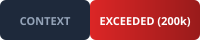 | `` |
| **AI Reviewer Approved** |  | `` |
| **Refactored by Claude** | 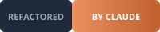 | `` |
| **YOLO Deploy** |  | `` |

---

### Banners

| Banner | Preview | Raw Markdown |
| :--- | :---: | :--- |
| **Vibe Coding Arena** |  | `` |
| **AI Coding Tools Pills** | 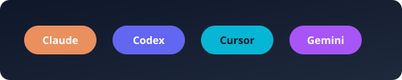 | `` |
| **LLM & Reasoning Models** |  | `` |
| **Agentic Workflow** | 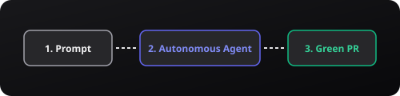 | `` |

---

### Platform and Tool Logos

The gallery uses the supplied platform and tool logo files directly. No replacement mascot or invented mark is used for these categories.

| Platform | Preview | Raw Markdown |
| :--- | :---: | :--- |
| **Claude Code** |  | `` |
| **OpenAI** |  | `` |
| **Codex** |  | `` |
| **Cursor** |  | `` |
| **Gemini CLI** |  | `` |
| **DeepSeek** |  | `` |
| **GitHub Copilot** |  | `` |

[Browse the complete supplied logo catalog](svgs/logos/README.md)

---

## System Architecture and Quality Gates

Every migrated animated asset satisfies `contractVersion: 1`. Supplied platform logos remain source artwork and are registered separately:

- **Physics-driven mascot rig**: One transform owner per motion concern, sampled ballistic arcs, damped arrivals, velocity-linked squash and synchronized contact shadows.
- **Accessibility Gate**: Root `<svg role="img" aria-labelledby="...">` with `<title id="...">` and `<desc id="...">`.
- **DOM ID Safety**: Reusable IDs are scoped with `<filename-stem>-` prefixes to eliminate ID collisions when inlining multiple SVGs.
- **Motion Accessibility**: `@media (prefers-reduced-motion: reduce)` fallbacks present on all animated SVGs.
- **Motion Bounds Gate**: Playwright samples each Claude Code animation across its full loop and fails when a visible animated component crosses the viewBox or the mascot remains static.
- **Repository SVGO Engine**: Custom `svgo.config.js` preserving viewBox, keyframes, title/desc, and accessibility attributes.

---

## Development and Verification

Requires **Bun 1.3.14** or later.

### Run Quality Gate & Tests

```bash
# Run full suite (SVG contracts, schema validation, typecheck, SVGO check)
bun run check

# Run Playwright visual regression snapshots
bun run snapshots

# Run SVGO optimization write mode (maintainers)
bun run svgo:write
```

### Inline SVG Namespacing

When embedding raw SVG markup directly into HTML, use `namespaceSvg()` to avoid ID collisions:

```ts
import { namespaceSvg } from "./scripts/svg-contracts";

const firstCard = namespaceSvg(svgSource, "card-1");
const secondCard = namespaceSvg(svgSource, "card-2");
```

---

## 📜 Trademark and Endorsement Notice

This repository contains original community artwork inspired by developer tools and AI products. Product names, logos, and trademarks belong to their respective owners.

Fan-made mascots and scenes in this repository are not endorsed by Anthropic, OpenAI, Cursor, Google, DeepSeek, GitHub, or other referenced companies. The MIT license applies to original repository code and artwork; it does not grant rights to third-party trademarks.

## 📄 License

Code and original artwork are released under the [MIT License](LICENSE).
