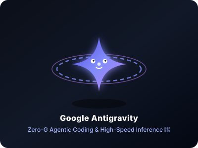
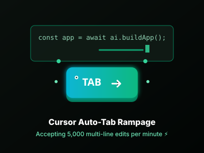
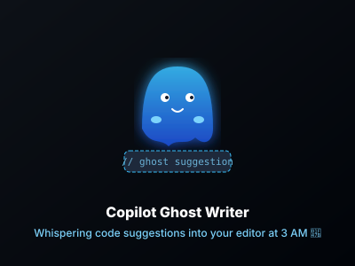

<p align="center">
  
</p>

<h1 align="center">✨ Vibe SVGs & Badges ✨</h1>
<p align="center">
  <b>A hilarious, vector-animated collection of SVGs, badges, and AI agent mascots for Vibe Coders, AI Engineers, and Agentic Software Developers!</b>
</p>

<p align="center">
  
  
  
  
  
</p>

---

## 🚀 About Vibe SVGs

Welcome to **Vibe SVGs** — the official open-source graphics library dedicated to the era of **Agentic Engineering** and **Vibe Coding**.

Every SVG in this library is **standalone**, scalable, dark/light mode compatible, and embedded with pure **CSS `@keyframes` animations**. They work natively inside GitHub `README.md` files, documentation pages, and web applications!

---

## 🤖 AI Agent Mascots

| Mascot | Preview | Markdown Copy Snippet |
| :--- | :---: | :--- |
| **Claude Code**<br>*(Deep Thinking)* |  | `` |
| **Google Antigravity**<br>*(Zero-G Levitating)* |  | `` |
| **Cursor AI**<br>*(Auto-Tab Rampage)* |  | `` |
| **ChatGPT**<br>*(100% Confident Hallucination)* |  | `` |
| **GitHub Copilot**<br>*(Ghost Writer)* |  | `` |
| **Devin**<br>*(Infinite Self-Fix Loop)* |  | `` |

---

## 🏷️ Animated Vibe Coding Badges

| Badge Name | Preview | Markdown Snippet |
| :--- | :---: | :--- |
| **0% Code Written By Human** |  | `` |
| **Prompt & Pray Strategy** |  | `` |
| **Context Window 99.9%** |  | `` |
| **Vibe Coding Certified** |  | `` |
| **AI Reviewer Approved** |  | `` |
| **Refactored Legacy Code** |  | `` |
| **YOLO Production Deploy** |  | `` |

---

## 📊 Banners & Flowcharts

<p align="center">
  <b>Agentic Engineering Workflow Flowchart</b><br>
  
</p>

---

## 💻 Local Development & Showcase App

Run the interactive web showcase application locally using **Bun**:

```bash
# Start local development server with Bun
bun x serve .
```

Open `http://localhost:3000` in your browser to explore the live gallery, copy markdown snippets, and use the **Interactive Custom Badge Generator**!

---

## 📄 License

This repository is licensed under the [MIT License](LICENSE). Feel free to use, modify, and share these SVGs across all your open-source projects and GitHub profiles!
